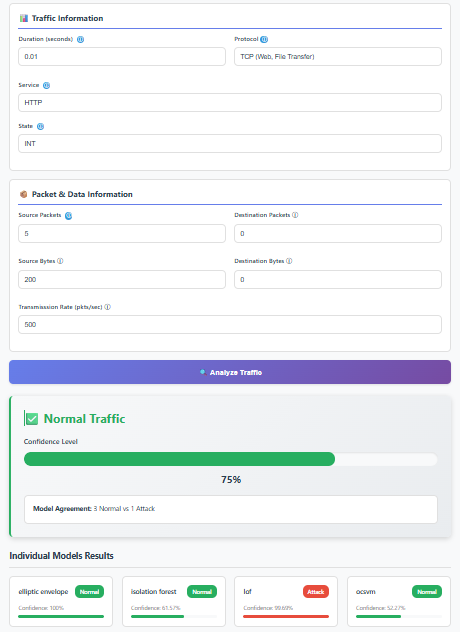
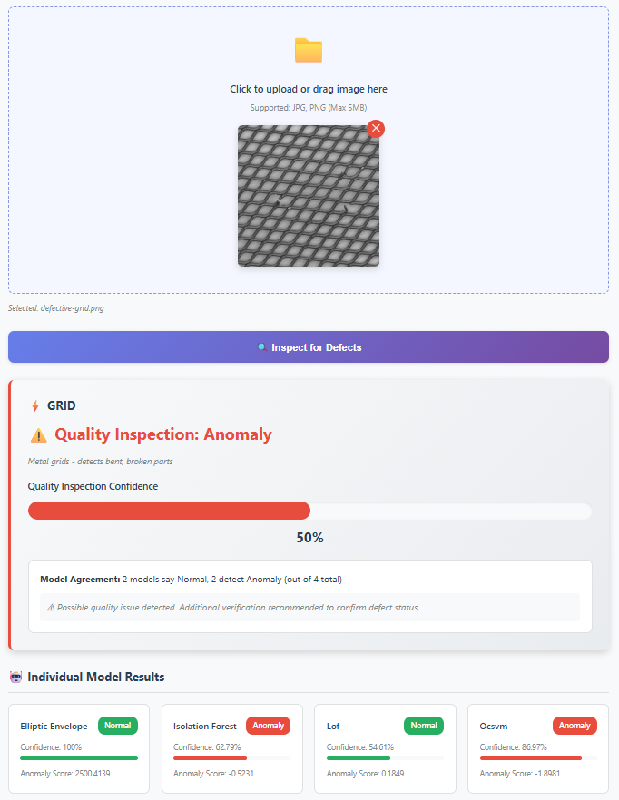
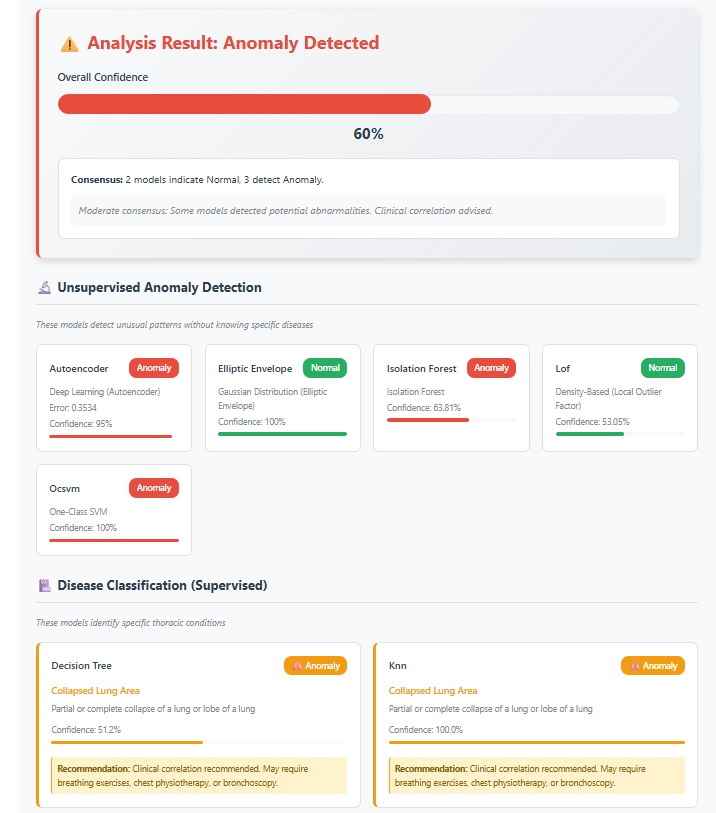

# 🤖 Techniques to Overcome Class Imbalance using Anomaly Detection  


**A specialized platform designed to handle extreme class imbalance by treating minority classes as anomalies. This project demonstrates precision based detection across Network, Manufacturing quality control and Medical domains using machine learning methods.**

---

## 🎯 Overview

This project addresses the "Imbalanced Data" problem in Machine Learning. In real-world scenarios like Network Intrusion or Medical Diagnosis, the "Anomaly" is often extremely rare. This API uses **Ensemble Anomaly Detection** to find those rare events without needing a perfectly balanced training set. Instead of needing perfectly balanced datasets, the system learns the boundary of "Normal" behavior and isolates outliers using a combination of Deep Learning (Autoencoders/ResNet) and Classical ML (Isolation Forest, One-Class SVM).

---

## 📊 Domains & Results showcase

> **Recruiter Note:** The following modules demonstrate the system's ability to adapt to entirely different data modalities (Tabular, RGB Vision, Grayscale Medical Vision).

### 1. 🌐 Cybersecurity: Network Intrusion Detection
* **Dataset:** UNSW-NB15 (2.5 million network flows, 44 dimensions)
* **Strategy:** Analyzes raw network packet features to identify 9 distinct categories of malicious traffic.
* **Models:** Isolation Forest, One-Class SVM, Elliptic Envelope, Local Outlier Factor (LOF).



### 2. 🏭 Manufacturing: Product Quality Inspection
* **Dataset:** MVTec AD (5,000+ high-resolution images across 15 product categories)
* **Strategy:** Uses Computer Vision to detect structural and visual defects (cracks, contamination, deformations) in industrial products.
* **Models:** ResNet34 (Feature Extraction) + 4 Anomaly Detectors.



### 3. 🏥 Healthcare: Chest X-ray Diagnostics
* **Dataset:** NIH Chest X-ray14 (112,120 frontal chest X-ray images)
* **Strategy:** Provides AI-assisted diagnostic analysis to detect 14 thoracic conditions (e.g., Pneumonia, Cardiomegaly, Atelectasis).
* **Models:** Unsupervised (Autoencoder, Isolation Forest, etc.) + Supervised (Decision Tree, KNN).




---

## 🔧 Class Imbalance Strategy

| Technique | Implementation | Benefit |
| :--- | :--- | :--- |
| **One-Class SVM** | Learns the boundary of "Normal" data. | Ignores the lack of minority samples. |
| **Autoencoders** | Reconstructs input; high error = anomaly. | Self-supervised; no labels required. |
| **Isolation Forest** | Isolates points in a tree structure. | Efficiently finds outliers in large data. |

---
## 🔬 Case Study : Isolation Forest
> **The Theory:** Anomalies are "few and different." In a tree-based structure, they are isolated much faster (shorter path) than normal points (longer path). This allows the API to detect attacks even if they were never seen during training.

---


## 📁 Dataset Setup & Model Artifact Generation

To generate the required trained models and serialized artifacts (.pkl files) used by the anomaly detection API, all Python notebooks within the other repository [**MEng — Techniques to overcome class imbalance using anomaly/defect detection**](https://github.com/tanishq14/MEng-Computer-Vision-and-Artificial-Intelligence-Project-). This repository must be executed end-to-end after setting up the datasets in the correct directory structure.

1. Download Datasets

Download the following datasets from their official sources:

- UNSW-NB15 – Network intrusion detection dataset

- MVTec AD – Industrial defect detection dataset

- NIH ChestXray14 – Medical imaging anomaly detection dataset

⚠️ Due to licensing restrictions, datasets are not included in this repository.

2. Execute All Notebooks

Each notebook must be run from top to bottom to:

- Preprocess datasets

- Train anomaly detection models

- Calibrate decision thresholds and anomaly scores

- Serialize trained models and preprocessing pipelines

This process generates .pkl files (e.g., trained models, PCA objects, scalers, encoders), which are saved locally and later loaded by the API for inference.

Examples of generated artifacts include:

- **Isolation Forest models**

- **One-Class SVM models**

- **PCA transformers**

- **Feature scalers and encoders**

---
## 🚀 Installation

### 1. Clone the Repository
```Bash
git clone https://github.com/tanishq14
cd anomaly-detection-api
```
### 2. Install Docker Desktop

Go to: [Docker Desktop](https://docs.docker.com/docker-for-windows/install/)


---

## ⚡ Quick Start

### Start the API Server

```Bash
docker-compose up
```

## 📚 API Documentation

### Endpoints

| Method | Endpoint | Description |
|--------|----------|-------------|
| `GET` | `/` | Homepage |
| `GET` | `/network` | Network detection UI |
| `GET` | `/mvtec` | MVTec inspection UI |
| `GET` | `/xray` | X-ray analysis UI |
| `POST` | `/api/predict/network` | Network intrusion detection |
| `POST` | `/api/predict/mvtec` | Product quality inspection |
| `POST` | `/api/predict/xray` | Chest X-ray analysis |
| `GET` | `/api/health` | Health check |
| `GET` | `/api/models/info` | Model information |

### Response Format

#### All API responses follow this structure:
```
{
"success": true,
"timestamp": "2025-12-26T15:13:00.000000",
"api_version": "2.0",
"data": {
"ensemble": {
"prediction": "Normal",
"confidence": 95.5,
"votes": { "Normal": 3, "Anomaly": 1 }
},
"models": { ... },
"processing_time": "0.234s"
}
}
```

---

## 📊 Datasets

### Network: [UNSW-NB15](https://www.kaggle.com/datasets/mrwellsdavid/unsw-nb15)
- **Records**: 2.5 million network flows
- **Features**: 44 dimensions
- **Attack Types**: 9 categories (DoS, Exploits, Reconnaissance, etc.)
- **Split**: 80% train, 20% test

### MVTec: [AD](https://www.mvtec.com/company/research/datasets/mvtec-ad)
- **Images**: 5,000+ high-resolution product images
- **Categories**: 15 product types
- **Defects**: Cracks, scratches, contamination, missing parts
- **Split**: Per-category train/test

### X-ray: [NIH Chest X-ray14](https://www.kaggle.com/datasets/nih-chest-xrays/data)
- **Images**: 112,120 frontal chest X-rays
- **Conditions**: 14 thoracic pathologies
- **Classes**: Multi-label classification
- **Resolution**: 224x224 (preprocessed)

<!-- For dataset details, see [DATASETS.md](docs/DATASETS.md) -->

---

## 🏗️ Architecture

### System Overview

The project is built with a modern, decoupled architecture, containerized via Docker for easy deployment.

```text
[ React Frontend ]  <-- REST API -->  [ Flask Backend ]
       |                                      |
  User Uploads                          Data Validation
  Visual Dashboards                     Feature Preprocessing
  Confidence Metrics                    (ResNet34 / PCA)
                                              |
                                     [ Parallel Inference ]
                                     ├── Model 1 (e.g., Isolation Forest)
                                     ├── Model 2 (e.g., One-Class SVM)
                                     ├── Model 3 (e.g., Autoencoder)
                                     └── Model 4 (e.g., LOF)
                                              |
                                     [ Ensemble Aggregator ]
                                     └── Majority Voting & Confidence Scoring
```

---

### Models by Domain

**Network** (4 models):
- Isolation Forest
- One-Class SVM
- Elliptic Envelope
- Local Outlier Factor (LOF)

**MVTec** (5 components):
- ResNet34 (feature extraction)
- Isolation Forest
- One-Class SVM
- Elliptic Envelope
- LOF

**X-ray** (7 models):
- Autoencoder (unsupervised)
- Isolation Forest (unsupervised)
- One-Class SVM (unsupervised)
- Elliptic Envelope (unsupervised)
- LOF (unsupervised)
- Decision Tree (supervised)
- K-Nearest Neighbors (supervised)

---

## 📝 Usage Examples

### Python API
```python
from modules import predict_network, predict_mvtec, predict_xray

Network detection with preset
result = predict_network({'preset': 'normal_web_browsing'})
print(result['ensemble']['prediction']) # 'Normal' or 'Attack'

Product quality inspection
result = predict_mvtec('product_image.png')
if result['ensemble']['prediction'] == 'Anomaly':
print(f"Defect detected! Confidence: {result['ensemble']['confidence']}%")

Medical X-ray analysis
result = predict_xray('chest_xray.png')
for model, data in result['supervised_models'].items():
print(f"{model}: {data['prediction']} ({data['confidence']:.1f}%)")
```

### Web Interface

1. Navigate to https://anomaly-detection-api.vercel.app/
2. Select a detection module
3. Upload image or enter data
4. View comprehensive results with visualizations

---

## 📈 Performance Metrics

| Domain | Data Type | Imabalance Ratio | Accuracy | Precision | Recall | F1-Score | Models |
|--------|----------|------------------|----------|-----------|--------|----------|--------|
| **Network** | Tabular | Extreme | 99.2% | 98.5% | 99.1% | 98.8% | 4 |
| **MVTec** | RGB Image | High | 95.8% | 94.2% | 96.1% | 95.1% | 4 |
| **X-ray** | Grayscale Image| Moderate | 92.3% | 91.8% | 92.7% | 92.2% | 7 |

*Metrics calculated on respective test sets using ensemble predictions*

---

## 🧪 Testing


<!-- ## 🚢 Deployment

For production deployment:

1. **Set production config** in `app.py`:
app.config['DEBUG'] = False

2. **Use production server** (e.g., Gunicorn):
pip install gunicorn
gunicorn -w 4 -b 0.0.0.0:8000 app:app


3. **Set up reverse proxy** (Nginx/Apache)

4. **Enable HTTPS** with SSL certificates

See [DEPLOYMENT.md](docs/DEPLOYMENT.md) for detailed instructions. -->

<!-- --- -->

## 🤝 Contributing

Contributions are welcome! Please follow these steps:

1. Fork the repository
2. Create a feature branch (`git checkout -b feature/AmazingFeature`)
3. Commit your changes (`git commit -m 'Add some AmazingFeature'`)
4. Push to the branch (`git push origin feature/AmazingFeature`)
5. Open a Pull Request

---

## 📄 License

This project is licensed under the MIT License - see the [LICENSE](LICENSE) file for details.

---

## 👨‍💻 Author

**Tanishq Rahul Shelke**

- Masters in Engineering (MEng) - Machine Learning Engineer
- Focus: Anomaly Detection, Ensemble Methods, Deep Learning
- LinkedIn: [Tanishq Shelke](https://www.linkedin.com/in/tanishq-rahul-s-614220210/)
- GitHub: [Tanishq14](https://github.com/tanishq14)

---

## 🙏 Acknowledgments

- **UNSW-NB15 Dataset**: University of New South Wales
- **MVTec AD Dataset**: MVTec Software GmbH
- **NIH Chest X-ray14**: National Institutes of Health
- **PyTorch Team**: For the deep learning framework
- **Scikit-learn Team**: For machine learning tools

---

## 📞 Support

For issues, questions, or suggestions:
- Open an [Issue](https://github.com/tanishq14/anomaly_detection_api/issues)

---

**⭐ If you find this project useful, please consider giving it a star!**

*Last Updated: March 23, 2026*
# anomaly_detection_api

## 📄 License
This project is licensed under the MIT License - see the [LICENSE](LICENSE) file for details.
